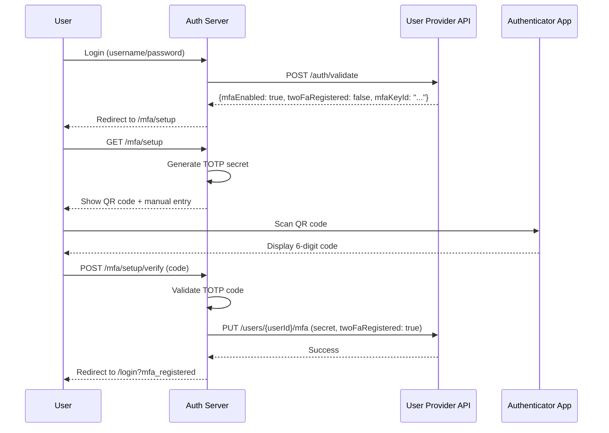
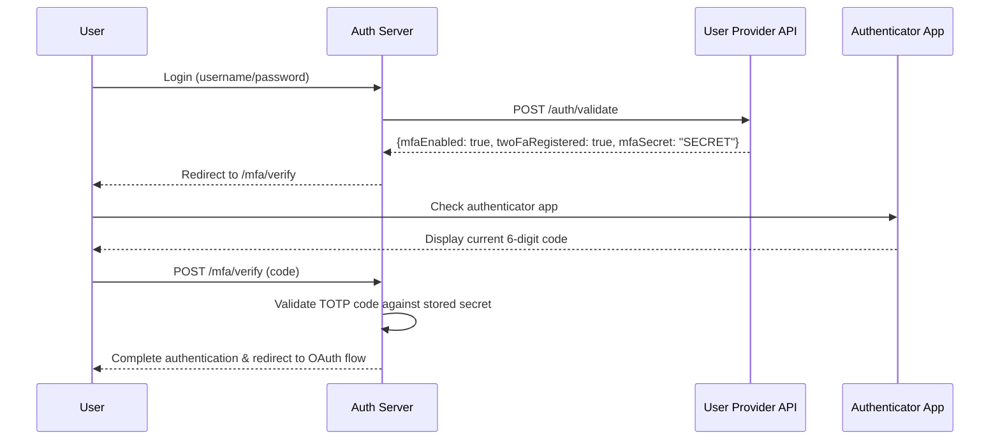

## MFA Flow

### 1. First-Time MFA Setup



### 2. Subsequent Logins with MFA



---

## Configuration Requirements

### Tenant Configuration (YAML)

Add MFA registration endpoint to tenant configuration:

```yaml
wedge:
  tenants:
    - id: "default-tenant"
      name: "Default Tenant"
      userProviderPort:
        endpoint: "http://localhost:8080/api/v1/auth/validate"
        timeout: 5000
        mfaRegistrationEndpoint: "http://localhost:8080/api/v1/users/{userId}/mfa"
```

### Tenant Configuration (Database)

```sql
UPDATE tenants 
SET mfa_registration_endpoint = 'http://localhost:8080/api/v1/users/{userId}/mfa'
WHERE id = 'your-tenant-id';
```

### User Provider API Requirements

Your user provider API must:

1. **Return MFA fields in authentication responses**:
   ```json
   {
     "userId": "user123",
     "username": "user@example.com",
     "email": "user@example.com",
     "metadata": {},
     "mfaEnabled": true,
     "mfaData": {
       "twoFaRegistered": false,
       "mfaKeyId": "WedgeAuth:user@example.com",
       "mfaSecret": null
     }
   }
   ```

2. **Implement MFA registration endpoint**:
   ```
   PUT/PATCH /api/v1/users/{userId}/mfa
   ```
   
   Request body:
   ```json
   {
     "mfaSecret": "BASE32ENCODEDSECRET",
     "twoFaRegistered": true,
     "mfaKeyId": "WedgeAuth:user@example.com"
   }
   ```

3. **Security requirements**:
   - Store `mfaSecret` encrypted at rest
   - Only return secret when `twoFaRegistered=false` (during setup)
   - Never return secret in subsequent logins when `twoFaRegistered=true`

---
