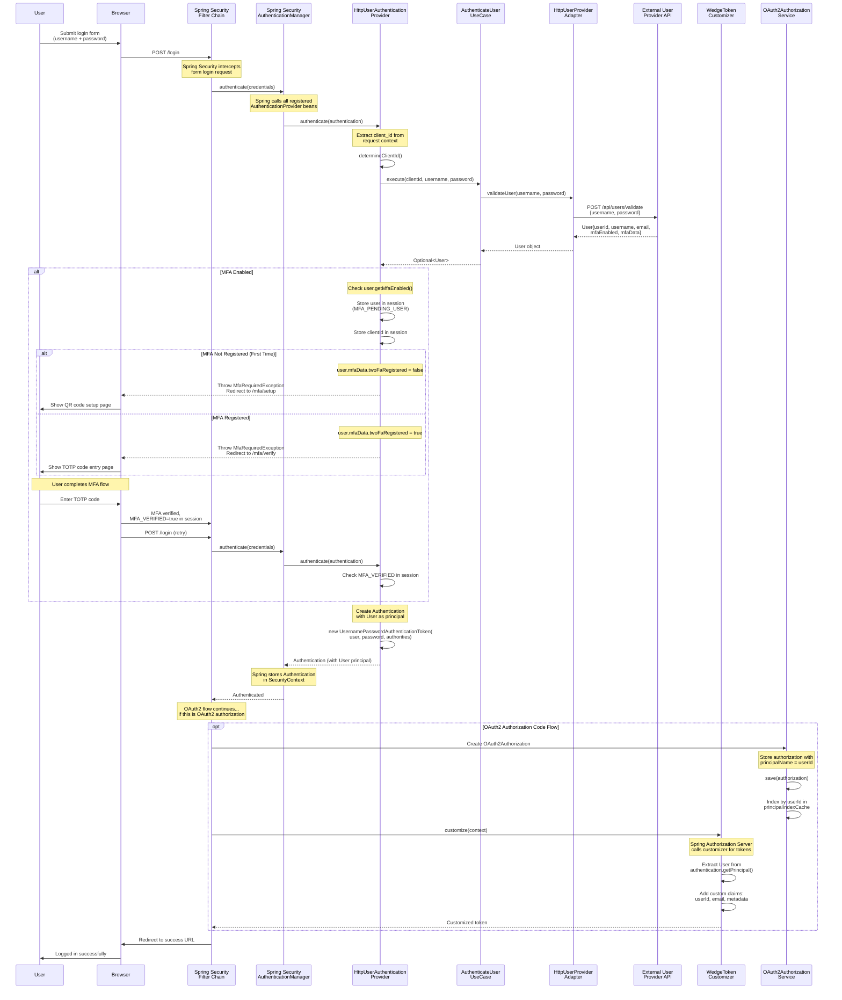

# Authentication Flow Architecture

This diagram shows how user authentication works with the custom HTTP user provider.

## Key Points

### Spring Security "Magic"

1. **AuthenticationManager** (Spring Security)
   - Automatically configured by Spring Boot
   - Iterates through all `AuthenticationProvider` beans
   - Calls `supports()` to find matching provider
   - Calls `authenticate()` on matching provider

2. **SecurityFilterChain** (Spring Security)
   - Configured in `SecurityConfig.defaultSecurityFilterChain()`
   - Processes form login via `.formLogin()` configuration
   - Stores `Authentication` in `SecurityContext` after successful authentication

3. **OAuth2AuthorizationServerConfigurer** (Spring Authorization Server)
   - Automatically configured via `.oauth2AuthorizationServer()`
   - Intercepts OAuth2 endpoints (`/oauth2/authorize`, `/oauth2/token`)
   - Calls `OAuth2TokenCustomizer` beans during token generation

### Custom Components

1. **HttpUserAuthenticationProvider**
   -Implements `AuthenticationProvider` interface
   - Registered as Spring `@Component`
   - Spring automatically discovers and registers it
   - **MFA Integration**: Checks `user.getMfaEnabled()` after password validation
   - Throws `MfaRequiredException` to trigger MFA setup/verification flow
   - Manages MFA session states (MFA_PENDING_USER, MFA_VERIFIED)

2. **WedgeTokenCustomizer**
   - Implements `OAuth2TokenCustomizer<JwtEncodingContext>`
   - Registered as Spring `@Bean`
   - Called by Spring Authorization Server during JWT generation

3. **AuthenticateUserUseCase** (Domain Layer)
   - Pure business logic
   - No Spring dependencies
   - Called by infrastructure layer

### Principal Storage

- **During Login**: `User` object stored as `Authentication.principal`
- **In OAuth2Authorization**: `userId` stored as `principalName`
- **In JWT**: Custom claims added via `WedgeTokenCustomizer`
- **During Logout**: `User` extracted from `Authentication.principal` to get `userId`

### MFA Flow

When `user.getMfaEnabled() == true`:
1. **Password Valid** → User stored in session as `MFA_PENDING_USER`
2. **Check MFA Registration**:
   - Not registered → Redirect to `/mfa/setup` (QR code page)
   - Already registered → Redirect to `/mfa/verify` (TOTP input page)
3. **After MFA Verification** → Session marked as `MFA_VERIFIED=true`
4. **Retry Login** → Authentication completes successfully

See [MFA Architecture](../mfa-architecture.md) for detailed MFA flow diagrams.
