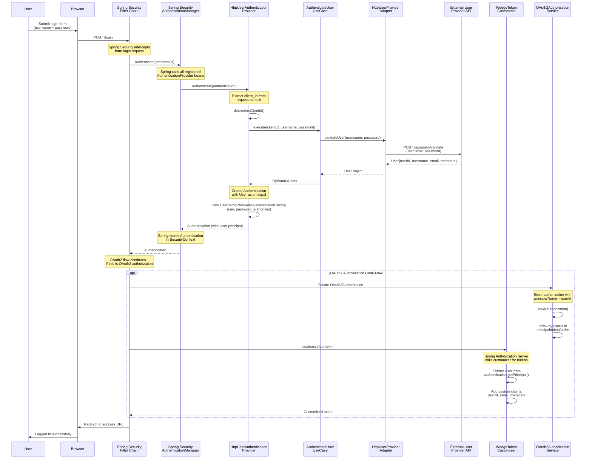

# Authentication Flow Architecture

This diagram shows how user authentication works with the custom HTTP user provider.

```mermaid
sequenceDiagram
    participant User
    participant Browser
    participant SecurityFilterChain as Spring Security<br/>Filter Chain
    participant AuthManager as Spring Security<br/>AuthenticationManager
    participant AuthProvider as HttpUserAuthentication<br/>Provider
    participant UseCase as AuthenticateUser<br/>UseCase
    participant UserProvider as HttpUserProvider<br/>Adapter
    participant ExternalAPI as External User<br/>Provider API
    participant TokenCustomizer as WedgeToken<br/>Customizer
    participant AuthService as OAuth2Authorization<br/>Service

    User->>Browser: Submit login form<br/>(username + password)
    Browser->>SecurityFilterChain: POST /login
    
    Note over SecurityFilterChain: Spring Security intercepts<br/>form login request
    SecurityFilterChain->>AuthManager: authenticate(credentials)
    
    Note over AuthManager: Spring calls all registered<br/>AuthenticationProvider beans
    AuthManager->>AuthProvider: authenticate(authentication)
    
    Note over AuthProvider: Extract client_id from<br/>request context
    AuthProvider->>AuthProvider: determineClientId()
    
    AuthProvider->>UseCase: execute(clientId, username, password)
    UseCase->>UserProvider: validateUser(username, password)
    
    UserProvider->>ExternalAPI: POST /api/users/validate<br/>{username, password}
    ExternalAPI-->>UserProvider: User{userId, username, email, metadata}
    UserProvider-->>UseCase: User object
    UseCase-->>AuthProvider: Optional<User>
    
    Note over AuthProvider: Create Authentication<br/>with User as principal
    AuthProvider->>AuthProvider: new UsernamePasswordAuthenticationToken(<br/>user, password, authorities)
    AuthProvider-->>AuthManager: Authentication (with User principal)
    
    Note over AuthManager: Spring stores Authentication<br/>in SecurityContext
    AuthManager-->>SecurityFilterChain: Authenticated
    
    Note over SecurityFilterChain: OAuth2 flow continues...<br/>if this is OAuth2 authorization
    
    opt OAuth2 Authorization Code Flow
        SecurityFilterChain->>AuthService: Create OAuth2Authorization
        Note over AuthService: Store authorization with<br/>principalName = userId
        AuthService->>AuthService: save(authorization)
        AuthService->>AuthService: Index by userId in<br/>principalIndexCache
        
        SecurityFilterChain->>TokenCustomizer: customize(context)
        Note over TokenCustomizer: Spring Authorization Server<br/>calls customizer for tokens
        TokenCustomizer->>TokenCustomizer: Extract User from<br/>authentication.getPrincipal()
        TokenCustomizer->>TokenCustomizer: Add custom claims:<br/>userId, email, metadata
        TokenCustomizer-->>SecurityFilterChain: Customized token
    end
    
    SecurityFilterChain->>Browser: Redirect to success URL
    Browser->>User: Logged in successfully
```

## Key Points

### Spring Security "Magic"

1. **AuthenticationManager** (Spring Security)
   - Automatically configured by Spring Boot
   - Iterates through all `AuthenticationProvider` beans
   - Calls `supports()` to find matching provider
   - Calls `authenticate()` on matching provider

2. **SecurityFilterChain** (Spring Security)
   - Configured in `SecurityConfig.defaultSecurityFilterChain()`
   - Processes form login via `.formLogin()` configuration
   - Stores `Authentication` in `SecurityContext` after successful authentication

3. **OAuth2AuthorizationServerConfigurer** (Spring Authorization Server)
   - Automatically configured via `.oauth2AuthorizationServer()`
   - Intercepts OAuth2 endpoints (`/oauth2/authorize`, `/oauth2/token`)
   - Calls `OAuth2TokenCustomizer` beans during token generation

### Custom Components

1. **HttpUserAuthenticationProvider**
   - Implements `AuthenticationProvider` interface
   - Registered as Spring `@Component`
   - Spring automatically discovers and registers it

2. **WedgeTokenCustomizer**
   - Implements `OAuth2TokenCustomizer<JwtEncodingContext>`
   - Registered as Spring `@Bean`
   - Called by Spring Authorization Server during JWT generation

3. **AuthenticateUserUseCase** (Domain Layer)
   - Pure business logic
   - No Spring dependencies
   - Called by infrastructure layer

### Principal Storage

- **During Login**: `User` object stored as `Authentication.principal`
- **In OAuth2Authorization**: `userId` stored as `principalName`
- **In JWT**: Custom claims added via `WedgeTokenCustomizer`
- **During Logout**: `User` extracted from `Authentication.principal` to get `userId`
