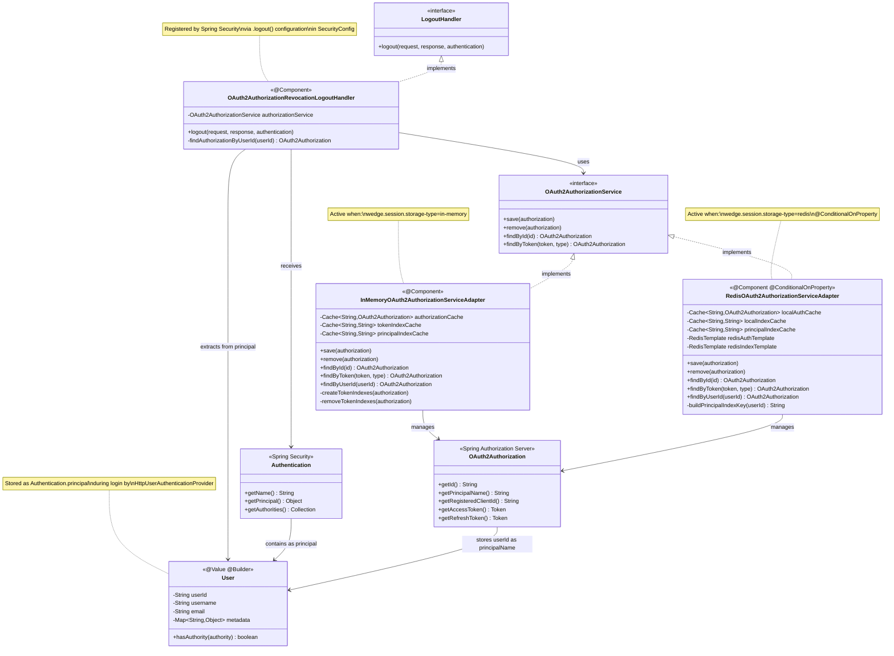

# Class Diagram - Logout Components

This diagram shows the relationships between logout-related classes.



## Component Responsibilities

### OAuth2AuthorizationRevocationLogoutHandler

**Purpose**: Revoke OAuth2 authorizations when user logs out

**Spring Integration**:
- Annotated with `@Component` - Spring auto-discovers
- Implements `LogoutHandler` interface
- Injected into `SecurityConfig.defaultSecurityFilterChain()`:
  ```java
  .logout(logout -> logout
      .addLogoutHandler(logoutHandler) // Spring calls this on /logout
      .logoutSuccessUrl("/login?logout=true"))
  ```

**Key Methods**:
- `logout()`: Called by Spring Security's `LogoutFilter`
- `findAuthorizationByUserId()`: Helper to find authorizations

### InMemoryOAuth2AuthorizationServiceAdapter

**Purpose**: Store OAuth2 authorizations in memory using Caffeine cache

**Spring Integration**:
- Annotated with `@Component`
- Implements `OAuth2AuthorizationService` (Spring Authorization Server interface)
- Active by default when `wedge.session.storage-type=in-memory`

**Caching Strategy**:
- `authorizationCache`: Main storage (authId → OAuth2Authorization)
- `tokenIndexCache`: Token lookup (tokenValue → authId)
- `principalIndexCache`: User lookup (userId → authId) **← NEW for logout**

### RedisOAuth2AuthorizationServiceAdapter

**Purpose**: Store OAuth2 authorizations in Redis with L1/L2 caching

**Spring Integration**:
- Annotated with `@Component`
- Annotated with `@ConditionalOnProperty(name = "wedge.session.storage-type", havingValue = "redis")`
- Only active when Redis is configured
- Spring creates this bean conditionally

**Caching Strategy**:
- L1 Cache: Caffeine (in-memory, fast)
- L2 Cache: Redis (distributed, persistent)
- Same indexing as in-memory adapter

### User (Domain Model)

**Purpose**: Represent authenticated user

**Spring Integration**:
- No Spring dependencies (pure domain model)
- Created by `HttpUserAuthenticationProvider`
- Stored as `Authentication.principal` by Spring Security
- Extracted during logout to get `userId`

**Lombok Annotations**:
- `@Value`: Immutable class
- `@Builder`: Builder pattern
