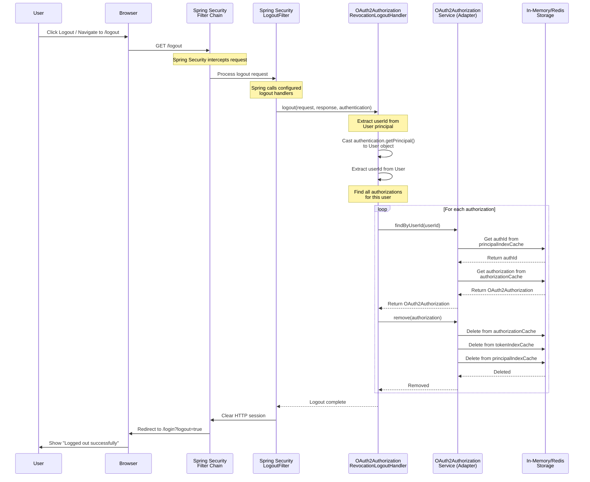

# Logout Flow Architecture

This diagram shows the complete logout flow with token revocation.

## Key Points

### Spring Security Integration

1. **LogoutFilter** (Spring Security)
   - Automatically configured by Spring Security
   - Intercepts `/logout` requests
   - Calls all registered `LogoutHandler` beans
   - Configured in `SecurityConfig.defaultSecurityFilterChain()`

2. **Filter Chain** (Spring Security)
   - Processes all HTTP requests
   - Applies security rules
   - Manages authentication state

### Custom Components

1. **OAuth2AuthorizationRevocationLogoutHandler**
   - Custom `LogoutHandler` implementation
   - Registered as Spring `@Component`
   - Injected into logout configuration via constructor

2. **OAuth2AuthorizationService Adapters**
   - `InMemoryOAuth2AuthorizationServiceAdapter`
   - `RedisOAuth2AuthorizationServiceAdapter`
   - Implement principal indexing for userId lookup

### Token Revocation Process

1. **Refresh Tokens**: Immediately revoked (removed from storage)
2. **Access Tokens**: Remain valid until expiration (JWT limitation)
3. **Recommendation**: Use 3-5 minute TTL for access tokens in production
