# OAuth2 Authorization Code Flow with PKCE

This diagram shows the complete OAuth2 authorization code flow with PKCE and token customization.

```mermaid
sequenceDiagram
    participant Client as OAuth2 Client<br/>(SPA/Mobile App)
    participant Browser
    participant AuthServer as Authorization Server<br/>(WedgeAuth)
    participant SpringAuthServer as Spring Authorization Server<br/>(Framework)
    participant AuthProvider as HttpUserAuthentication<br/>Provider
    participant TokenCustomizer as WedgeToken<br/>Customizer
    participant AuthService as OAuth2Authorization<br/>Service
    participant UserAPI as External User<br/>Provider API

    Note over Client: 1. Generate PKCE values
    Client->>Client: code_verifier = random()
    Client->>Client: code_challenge = SHA256(code_verifier)
    
    Note over Client,Browser: 2. Authorization Request
    Client->>Browser: Redirect to /oauth2/authorize<br/>?client_id=...&redirect_uri=...&<br/>code_challenge=...&code_challenge_method=S256
    
    Browser->>AuthServer: GET /oauth2/authorize
    
    Note over AuthServer,SpringAuthServer: Spring Authorization Server<br/>intercepts request
    SpringAuthServer->>SpringAuthServer: Validate client_id
    SpringAuthServer->>SpringAuthServer: Validate redirect_uri
    SpringAuthServer->>SpringAuthServer: Store code_challenge in session
    
    alt User not authenticated
        SpringAuthServer->>Browser: Redirect to /login
        Browser->>AuthServer: GET /login
        AuthServer->>Browser: Show login form
        
        Browser->>AuthServer: POST /login<br/>(username + password)
        
        Note over AuthServer: Spring Security processes login
        AuthServer->>AuthProvider: authenticate(credentials)
        AuthProvider->>UserAPI: POST /api/users/validate
        UserAPI-->>AuthProvider: User{userId, username, email}
        AuthProvider->>AuthProvider: Create Authentication<br/>with User as principal
        AuthProvider-->>AuthServer: Authentication
        
        Note over AuthServer: Spring Security stores<br/>Authentication in SecurityContext
        AuthServer->>Browser: Redirect back to /oauth2/authorize
        Browser->>AuthServer: GET /oauth2/authorize (with session)
    end
    
    Note over SpringAuthServer: 3. Generate Authorization Code
    SpringAuthServer->>SpringAuthServer: Generate authorization_code
    SpringAuthServer->>AuthService: Save OAuth2Authorization<br/>(code, code_challenge, userId)
    
    Note over AuthService: Store with userId indexing
    AuthService->>AuthService: authorizationCache.put(authId, authorization)
    AuthService->>AuthService: principalIndexCache.put(userId, authId)
    
    SpringAuthServer->>Browser: Redirect to redirect_uri<br/>?code=...&state=...
    Browser->>Client: Authorization code received
    
    Note over Client,AuthServer: 4. Token Exchange
    Client->>AuthServer: POST /oauth2/token<br/>grant_type=authorization_code<br/>code=...&code_verifier=...
    
    Note over SpringAuthServer: Spring Authorization Server<br/>validates request
    SpringAuthServer->>AuthService: findByToken(code, AUTHORIZATION_CODE)
    AuthService-->>SpringAuthServer: OAuth2Authorization
    
    SpringAuthServer->>SpringAuthServer: Verify code_challenge matches<br/>SHA256(code_verifier)
    
    alt PKCE validation fails
        SpringAuthServer-->>Client: 400 Bad Request<br/>invalid_grant
    end
    
    Note over SpringAuthServer: 5. Generate Tokens
    SpringAuthServer->>SpringAuthServer: Generate access_token (JWT)
    SpringAuthServer->>SpringAuthServer: Generate refresh_token
    
    Note over SpringAuthServer: Call token customizers
    SpringAuthServer->>TokenCustomizer: customize(JwtEncodingContext)
    
    Note over TokenCustomizer: Extract User from Authentication
    TokenCustomizer->>TokenCustomizer: User user = (User) authentication.getPrincipal()
    TokenCustomizer->>TokenCustomizer: Add custom claims:<br/>- userId<br/>- email<br/>- metadata
    TokenCustomizer-->>SpringAuthServer: Customized JWT
    
    Note over SpringAuthServer: Save authorization with tokens
    SpringAuthServer->>AuthService: save(authorization with tokens)
    AuthService->>AuthService: Index by userId
    AuthService->>AuthService: Index by access_token
    AuthService->>AuthService: Index by refresh_token
    
    SpringAuthServer-->>Client: 200 OK<br/>{<br/>  access_token: "eyJ...",<br/>  refresh_token: "rt_...",<br/>  token_type: "Bearer",<br/>  expires_in: 1800<br/>}
    
    Note over Client: 6. Use Access Token
    Client->>AuthServer: GET /api/resource<br/>Authorization: Bearer eyJ...
    AuthServer->>AuthServer: Validate JWT signature
    AuthServer->>AuthServer: Check expiration
    AuthServer-->>Client: 200 OK + Resource
    
    Note over Client,AuthServer: 7. Refresh Token Flow
    Client->>AuthServer: POST /oauth2/token<br/>grant_type=refresh_token<br/>refresh_token=rt_...
    
    SpringAuthServer->>AuthService: findByToken(refresh_token, REFRESH_TOKEN)
    AuthService-->>SpringAuthServer: OAuth2Authorization
    
    SpringAuthServer->>SpringAuthServer: Generate new access_token
    SpringAuthServer->>TokenCustomizer: customize(JwtEncodingContext)
    TokenCustomizer-->>SpringAuthServer: Customized JWT
    
    SpringAuthServer->>AuthService: save(updated authorization)
    SpringAuthServer-->>Client: 200 OK<br/>{access_token: "new_eyJ...", ...}
```



## Spring Authorization Server Integration Points

### 1. OAuth2 Endpoint Auto-configuration

**Configuration** (`SecurityConfig.java`):
```java
@Bean
@Order(1)
public SecurityFilterChain authorizationServerSecurityFilterChain(HttpSecurity http) {
    OAuth2AuthorizationServerConfiguration.applyDefaultSecurity(http);
    http.oauth2AuthorizationServer(Customizer.withDefaults());
    return http.build();
}
```

**Spring Magic**:
- Creates `/oauth2/authorize` endpoint
- Creates `/oauth2/token` endpoint
- Creates `/oauth2/introspect` endpoint
- Creates `/oauth2/revoke` endpoint
- Creates `/.well-known/oauth-authorization-server` endpoint
- Creates `/oauth2/jwks` endpoint

### 2. OAuth2AuthorizationService Bean Discovery

**Spring Behavior**:
- Scans for `OAuth2AuthorizationService` bean
- Finds `InMemoryOAuth2AuthorizationServiceAdapter` or `RedisOAuth2AuthorizationServiceAdapter`
- Injects into OAuth2 endpoints automatically
- Uses for storing/retrieving authorizations

### 3. OAuth2TokenCustomizer Bean Discovery

**Spring Behavior**:
- Scans for all `OAuth2TokenCustomizer<JwtEncodingContext>` beans
- Calls each customizer during JWT generation
- Allows adding custom claims to tokens
- Called in order of `@Order` annotation

### 4. PKCE Validation

**Spring Authorization Server**:
- Automatically validates PKCE if `code_challenge` is present
- Stores `code_challenge` with authorization code
- Verifies `SHA256(code_verifier) == code_challenge` during token exchange
- Returns `invalid_grant` error if validation fails

### 5. Principal Name Storage

**Important**:
- Spring Authorization Server calls `authentication.getName()` to get principal name
- Since we store `User` object as principal, we need to ensure `getPrincipalName()` returns `userId`
- Our `HttpUserAuthenticationProvider` creates:
  ```java
  new UsernamePasswordAuthenticationToken(user, password, authorities)
  ```
- Spring Authorization Server stores this as `OAuth2Authorization.principalName`
- During logout, we extract `userId` from the `User` principal

## Token Lifecycle

### Access Token (JWT)
- **Generated**: During authorization code exchange or refresh token flow
- **Stored**: In `OAuth2Authorization` object
- **Indexed**: By token value in `tokenIndexCache`
- **Validated**: By JWT signature and expiration
- **Revoked**: Cannot be revoked (JWT limitation)
- **Expires**: After configured TTL (default 30 minutes)

### Refresh Token
- **Generated**: During authorization code exchange (if `offline_access` scope)
- **Stored**: In `OAuth2Authorization` object
- **Indexed**: By token value in `tokenIndexCache`
- **Validated**: By looking up in storage
- **Revoked**: Removed from storage during logout
- **Expires**: After configured TTL (default 30 days)

### Authorization Code
- **Generated**: During authorization request
- **Stored**: In `OAuth2Authorization` object with `code_challenge`
- **Indexed**: By code value in `tokenIndexCache`
- **Validated**: PKCE verification + one-time use
- **Revoked**: Automatically after token exchange
- **Expires**: After 5 minutes (Spring default)
