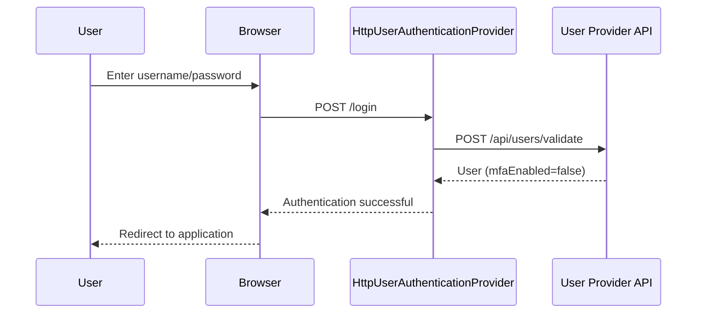
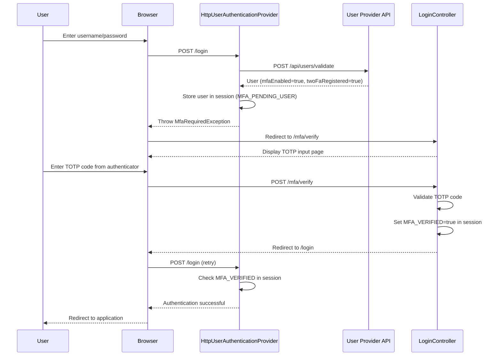
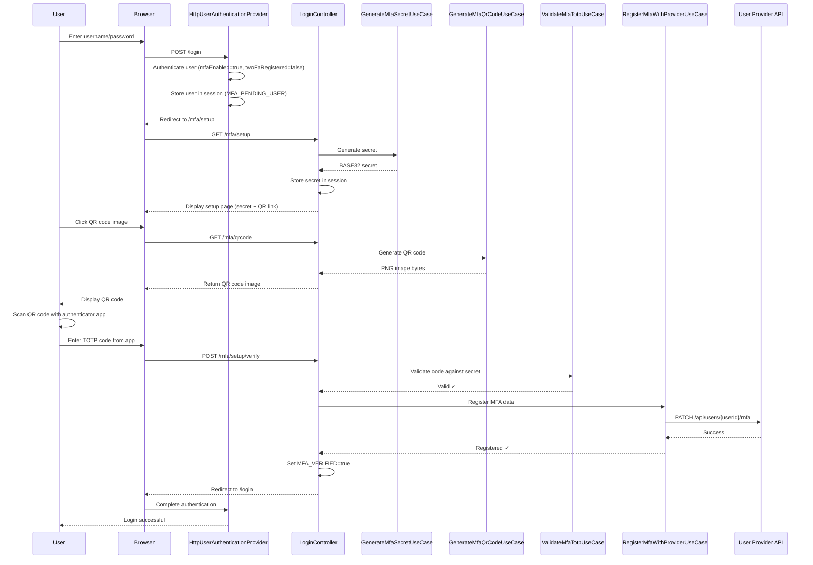
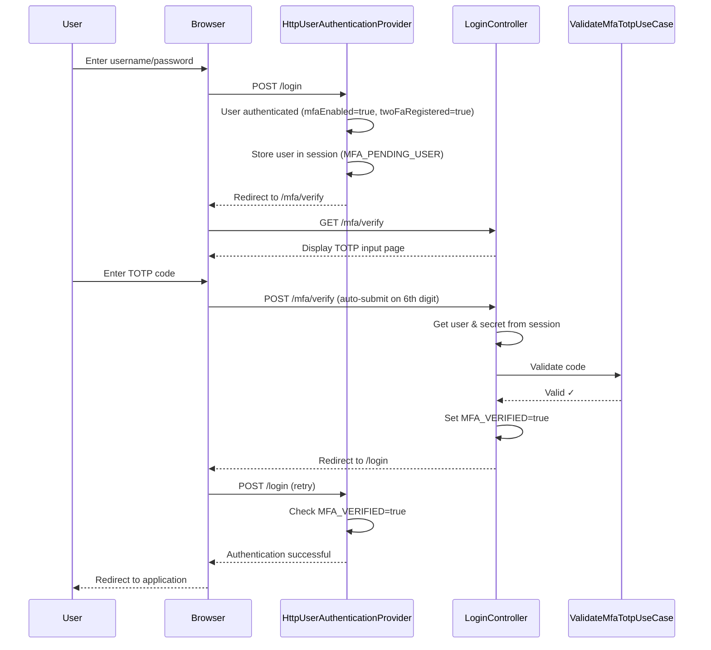

# Multi-Factor Authentication (MFA) Architecture

This document describes the technical architecture of the Multi-Factor Authentication (MFA) implementation in WedgeAuth.

## Table of Contents

- [Overview](#overview)
- [Architecture Principles](#architecture-principles)
- [Component Overview](#component-overview)
- [Authentication Flow](#authentication-flow)
- [MFA Setup Flow](#mfa-setup-flow)
- [MFA Verification Flow](#mfa-verification-flow)
- [Session Management](#session-management)
- [Data Models](#data-models)
- [REST API Integration](#rest-api-integration)
- [Security Considerations](#security-considerations)

---

## Overview

WedgeAuth implements TOTP-based (Time-based One-Time Password) Multi-Factor Authentication following RFC 6238 standards. The implementation follows hexagonal architecture principles, ensuring clean separation between business logic and infrastructure concerns.

### Key Features

- **TOTP-based MFA** using RFC 6238 standard
- **QR Code generation** for easy authenticator app setup
- **Manual secret entry** as fallback option
- **Session-based flow** for MFA setup and verification
- **Hexagonal architecture** with clear domain/application/infrastructure separation
- **External user provider integration** for MFA data persistence

---

## Architecture Principles

### Hexagonal Architecture (Ports & Adapters)

```
┌─────────────────────────────────────────────────────────────┐
│                         Domain Layer                         │
│  ┌─────────────┐  ┌──────────────┐  ┌──────────────────┐   │
│  │   MfaData   │  │     User     │  │   UserProvider   │   │
│  └─────────────┘  └──────────────┘  └──────────────────┘   │
│                                                              │
│  Ports (Interfaces):                                        │
│  • TotpService                                              │
│  • QrCodeService                                            │
│  • MfaRegistrationService                                   │
│  • ScopesValidationService                                  │
└─────────────────────────────────────────────────────────────┘
                            ▲
                            │
┌───────────────────────────┼─────────────────────────────────┐
│                    Application Layer                         │
│  Use Cases:                                                  │
│  • GenerateMfaSecretUseCase                                 │
│  • ValidateMfaTotpUseCase                                   │
│  • GenerateMfaQrCodeUseCase                                 │
│  • RegisterMfaWithProviderUseCase                           │
└─────────────────────────────────────────────────────────────┘
                            ▲
                            │
┌───────────────────────────┼─────────────────────────────────┐
│                   Infrastructure Layer                       │
│  Adapters (Implementations):                                │
│  • GoogleAuthenticatorTotpService (TotpService)             │
│  • ZxingQrCodeService (QrCodeService)                       │
│  • HttpMfaRegistrationAdapter (MfaRegistrationService)      │
│  • UserProviderRestClient                                   │
│                                                              │
│  Controllers:                                                │
│  • LoginController (/mfa/setup, /mfa/verify, /mfa/qrcode)  │
│                                                              │
│  Security:                                                   │
│  • HttpUserAuthenticationProvider                           │
└─────────────────────────────────────────────────────────────┘
```

### Design Principles

1. **Separation of Concerns**: Domain logic separate from infrastructure
2. **Dependency Inversion**: Domain defines interfaces, infrastructure implements
3. **Single Responsibility**: Each component has one clear purpose
4. **Testability**: All layers independently testable with mocks

---

## Component Overview

### Domain Layer

#### Models

**`MfaData`**
```java
@Value @Builder
public class MfaData {
  boolean twoFaRegistered;  // Has user completed MFA setup?
  String mfaKeyId;          // Display name (e.g., "WedgeAuth:user@example.com")
  String mfaSecret;         // Base32-encoded TOTP secret
}
```

**`User`**
```java
@Value @Builder
public class User {
  String userId;
  String username;
  String email;
  Map<String, Object> metadata;
  Boolean mfaEnabled;       // Is MFA required for this user?
  MfaData mfaData;          // MFA configuration data
}
```

#### Ports (Interfaces)

**`TotpService`** - TOTP generation and validation
- `String generateSecret()` - Generate Base32-encoded secret
- `boolean validateCode(String secret, String code)` - Validate TOTP code

**`QrCodeService`** - QR code generation
- `byte[] generateQrCode(String data, int width, int height)` - Generate PNG QR code

**`MfaRegistrationService`** - MFA data persistence
- `boolean registerMfa(String clientId, String userId, String mfaSecret, String mfaKeyId)` - Register MFA with external provider

### Application Layer

Use cases orchestrate business logic without infrastructure concerns:

1. **`GenerateMfaSecretUseCase`** - Generate new TOTP secret
2. **`ValidateMfaTotpUseCase`** - Validate TOTP code against secret
3. **`GenerateMfaQrCodeUseCase`** - Build OTPAUTH URI and generate QR code
4. **`RegisterMfaWithProviderUseCase`** - Send MFA data to user provider

### Infrastructure Layer

#### Adapters (Implementations)

**`GoogleAuthenticatorTotpService`** (TotpService)
- Uses `de.taimos:totp` library
- Generates cryptographically secure secrets
- Validates codes with configurable time window

**`ZxingQrCodeService`** (QrCodeService)
- Uses `com.google.zxing` library
- Generates PNG format QR codes
- Configurable dimensions

**`HttpMfaRegistrationAdapter`** (MfaRegistrationService)
- Resolves `UserProvider` configuration from `clientId`
- Builds MFA endpoint URL from template
- Delegates HTTP call to `UserProviderRestClient`

**`UserProviderRestClient`**
- Centralized HTTP client for user provider API
- Methods: `findByUsername`, `validateCredentials`, `registerMfa`
- Uses Spring's `RestClient` with error handling

#### Controllers

**`LoginController`**
- `GET /mfa/setup` - Display QR code for MFA registration
- `GET /mfa/qrcode` - Generate QR code image (PNG)
- `POST /mfa/setup/verify` - Verify TOTP and complete MFA setup
- `GET /mfa/verify` - Display TOTP verification page
- `POST /mfa/verify` - Verify TOTP during login

#### Security

**`HttpUserAuthenticationProvider`**
- Custom Spring Security `AuthenticationProvider`
- Checks `user.getMfaEnabled()` after password validation
- Manages MFA session states
- Throws `MfaRequiredException` to trigger MFA flow

---

## Authentication Flow

### Standard Login (No MFA)



### Login with MFA (Already Registered)



---

## MFA Setup Flow

When a user logs in with MFA enabled but not yet registered:



### Step-by-Step Breakdown

1. **Password Authentication**: User enters credentials, validated successfully
2. **MFA Check**: Auth provider detects `mfaEnabled=true, twoFaRegistered=false`
3. **Session Setup**: User stored in session as `MFA_PENDING_USER`, redirect to `/mfa/setup`
4. **Secret Generation**: New TOTP secret generated and stored in session
5. **QR Code Display**: Page shows QR code (via `/mfa/qrcode`) and manual secret entry option
6. **User Scans**: User scans QR code with authenticator app
7. **Verification**: User enters generated code, system validates against secret
8. **Registration**: If valid, secret sent to user provider API for persistent storage
9. **Completion**: Session marked as `MFA_VERIFIED`, authentication completes

---

## MFA Verification Flow

For subsequent logins after MFA is set up:



---

## Session Management

### Session Attributes

The MFA flow uses HTTP session attributes to maintain state:

| Attribute | Type | Purpose | Lifecycle |
|-----------|------|---------|-----------|
| `MFA_PENDING_USER` | `User` | Stores authenticated user awaiting MFA | Set after password auth, cleared after MFA complete |
| `MFA_VERIFIED` | `Boolean` | Flag indicating MFA verification success | Set after TOTP validation, cleared after final auth |
| `MFA_SECRET` | `String` | TOTP secret during setup | Set during setup, cleared after registration |
| `MFA_KEY_ID` | `String` | MFA key identifier during setup | Set during setup, cleared after registration |
| `CLIENT_ID` | `String` | OAuth client ID for current request | Set after password auth, used for user provider lookup |

### Session Flow States

```
┌─────────────────┐
│  Unauthenticated │
└─────────────────┘
         │
         │ POST /login (username/password)
         ▼
┌─────────────────┐
│  Password Valid  │ ← MFA_PENDING_USER set
│   CLIENT_ID set  │
└─────────────────┘
         │
         ├─ mfaEnabled=false ──────────────────────┐
         │                                         │
         ├─ mfaEnabled=true, twoFaRegistered=false ┤
         │                                         │
         │        Redirect /mfa/setup              │
         │              │                          │
         │              ▼                          │
         │     ┌──────────────┐                   │
         │     │  MFA Setup    │ ← MFA_SECRET set  │
         │     │  (QR + Code)  │   MFA_KEY_ID set  │
         │     └──────────────┘                   │
         │              │                          │
         │  POST /mfa/setup/verify (valid code)   │
         │              │                          │
         │              └──────┐                   │
         │                     │                   │
         ├─ mfaEnabled=true, twoFaRegistered=true ┤
         │                                         │
         │        Redirect /mfa/verify             │
         │              │                          │
         │              ▼                          │
         │      ┌─────────────┐                   │
         │      │ MFA Verify  │                   │
         │      │ (TOTP Code) │                   │
         │      └─────────────┘                   │
         │              │                          │
         │  POST /mfa/verify (valid code)         │
         │              │                          │
         │              ▼                          │
         │      MFA_VERIFIED=true                 │
         │              │                          │
         └──────────────┴──────────────────────────┘
                        │
                  Retry POST /login
                        │
                        ▼
              ┌──────────────────┐
              │  Fully Authenticated │
              │  (All attrs cleared) │
              └──────────────────┘
```

---

## Data Models

### Domain Models

**MfaData**
```java
@Value
@Builder
public class MfaData implements Serializable {
  boolean twoFaRegistered;  // MFA setup completed?
  String mfaKeyId;          // Display name for authenticator
  String mfaSecret;         // Base32-encoded TOTP secret
}
```

**User** (relevant MFA fields)
```java
@Value
@Builder
public class User {
  // ... other fields ...
  Boolean mfaEnabled;       // MFA required for this user?
  MfaData mfaData;          // MFA configuration (null if not enabled)
}
```

**UserProvider** (relevant MFA fields)
```java
@Value
@Builder
public class UserProvider {
  String endpoint;                  // e.g., "http://api.com/users/validate"
  int timeout;                      // API call timeout in ms
  String mfaRegistrationEndpoint;   // e.g., "http://api.com/users/{userId}/mfa"
}
```

### REST API Models

**UserResponse** (from user provider API)
```java
public record UserResponse(
  String userId,
  String username,
  String email,
  Map<String, Object> metadata,
  boolean mfaEnabled,
  MfaDataResponse mfaData
) {}
```

**MfaDataResponse**
```java
public record MfaDataResponse(
  boolean twoFaRegistered,
  String mfaKeyId,
  String mfaSecret
) {}
```

---

## REST API Integration

### User Provider API Contract

#### Validate Credentials (Existing)

**Endpoint:** `POST {userProviderEndpoint}`

**Request:**
```json
{
  "username": "user@example.com",
  "password": "password123"
}
```

**Response:** (Enhanced with MFA fields)
```json
{
  "userId": "user-uuid-123",
  "username": "user@example.com",
  "email": "user@example.com",
  "metadata": {},
  "mfaEnabled": true,
  "mfaData": {
    "twoFaRegistered": false,
    "mfaKeyId": "WedgeAuth:user@example.com",
    "mfaSecret": null
  }
}
```

#### Register MFA (New)

**Endpoint:** `PATCH {mfaRegistrationEndpoint}`
- Template: `http://api.example.com/users/{userId}/mfa`
- `{userId}` is replaced with actual user ID

**Request:**
```json
{
  "mfaSecret": "JBSWY3DPEHPK3PXP",
  "twoFaRegistered": true,
  "mfaKeyId": "WedgeAuth:user@example.com"
}
```

**Response:** HTTP 200 OK

### OTPAUTH URI Format

Generated for QR codes following RFC 6238:

```
otpauth://totp/{Issuer}:{AccountName}?secret={Secret}&issuer={Issuer}
```

**Example:**
```
otpauth://totp/WedgeAuth:user@example.com?secret=JBSWY3DPEHPK3PXP&issuer=WedgeAuth
```

**Components:**
- **Issuer**: `MFA_ISSUER_NAME` (e.g., "WedgeAuth")
- **AccountName**: User's email or username
- **Secret**: Base32-encoded TOTP secret
- **Algorithm**: HMAC-SHA1 (default, not specified)
- **Digits**: 6 (default, not specified)
- **Period**: 30 seconds (default, not specified)

---

## Security Considerations

### Threat Model

| Threat | Mitigation |
|--------|------------|
| **Phishing** | TOTP codes expire after 30 seconds, limiting attack window |
| **Man-in-the-Middle** | All communication over HTTPS (enforced) |
| **Secret Exposure** | Secrets encrypted at rest in user provider database |
| **Session Hijacking** | HTTP-only cookies, secure flag in production |
| **Brute Force** | Rate limiting on `/mfa/verify` endpoint (recommended) |
| **Replay Attacks** | TOTP codes are time-based, single-use within window |

### Best Practices

1. **HTTPS Only**: All MFA endpoints require HTTPS in production
2. **Encrypted Storage**: User provider must encrypt `mfaSecret` at rest
3. **Secret Rotation**: Secrets never exposed after initial registration
4. **Session Security**: 
   - HTTP-only cookies
   - Secure flag when HTTPS
   - Short session timeouts
5. **Time Synchronization**: Server NTP sync critical for TOTP validation
6. **Logging**: Never log TOTP codes or secrets
7. **Rate Limiting**: Implement on MFA verification endpoints

### Configuration Security

**Development:**
```yaml
mfa:
  issuer-name: WedgeAuth-Dev
  qr-code-size: 300
```

**Production:**
```yaml
mfa:
  issuer-name: MyCompany
  qr-code-size: 250
```

**User Provider Endpoint:**
```yaml
user-provider:
  mfa-registration-endpoint: https://api.example.com/users/{userId}/mfa
```

---

## Testing Strategy

### Unit Tests

- **TOTP Service**: Secret generation, code validation, edge cases
- **QR Code Service**: PNG generation, dimensions, encoding
- **Use Cases**: Business logic without infrastructure
- **REST Client**: HTTP interactions with mocking

### Integration Tests (Recommended)

1. **Full MFA Setup Flow**
   - Login → Setup → QR generation → Verification → Registration
2. **Full MFA Verification Flow**
   - Login → Verify → Complete authentication
3. **Error Scenarios**
   - Invalid codes
   - Expired codes
   - Network failures

### Manual Testing Checklist

- [ ] QR code scans successfully with Google Authenticator
- [ ] QR code scans successfully with Microsoft Authenticator
- [ ] Manual secret entry works
- [ ] TOTP code validation works
- [ ] MFA data persists in user provider
- [ ] Subsequent logins require TOTP
- [ ] Invalid codes are rejected
- [ ] Session state is properly managed

---

## Future Enhancements

### Potential Improvements

1. **TOTP Window Configuration**: Make time window user-configurable
2. **Backup Codes**: Generate one-time recovery codes
3. **Multiple Devices**: Allow users to register multiple authenticators
4. **SMS Fallback**: Optional SMS-based MFA (less secure)
5. **Push Notifications**: Mobile app push for approval
6. **Biometric Integration**: Face/fingerprint on supported devices
7. **Admin MFA Controls**: Force MFA for specific user groups
8. **MFA Audit Logs**: Track setup, verification attempts, failures

### Scalability Considerations

- **Redis Session Storage**: For distributed deployments
- **Stateless TOTP Validation**: Consider JWT-based approach
- **CDN for QR Codes**: Cache QR code images if high traffic
- **Database Sharding**: For user provider at scale

---

## Related Documentation

- [Environment Variables](./environment-variables.md) - MFA configuration options
- [MFA User Guide](./mfa-user-guide.md) - End-user setup instructions
- [RFC 6238](https://tools.ietf.org/html/rfc6238) - TOTP specification
- [Spring Security Documentation](https://docs.spring.io/spring-security/reference/) - Authentication framework
